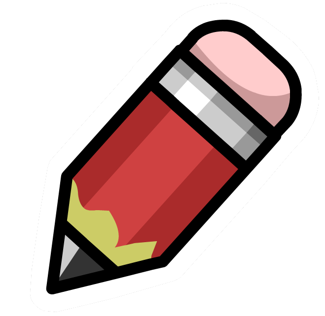
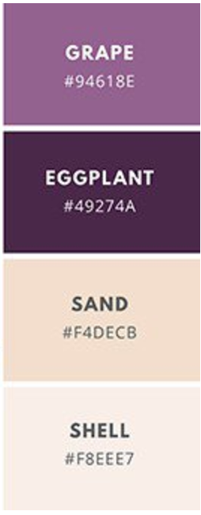
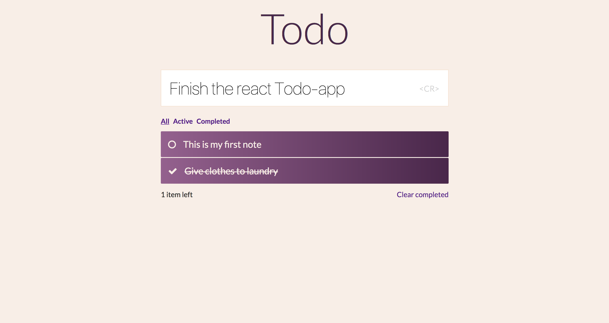

# TODO   
`A todo app like the others in the market, built on react but designed differently (I hope).`

## Take a look

ColorScheme                |  Final look in Web
:-------------------------:|:-------------------------:
  |  
